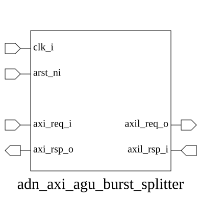

# adn_axi_agu_burst_splitter (module)

### Author: Motasim Faiyaz (motasimfaiyaz@gmail.com)

### Source: adn_axi_agu_burst_splitter.sv

## Top IO

## Parameters

|Name|Type|Dimension|Default|Description|
|-|-|-|-|-|
|ADDR_WIDTH|int||32|//////////////////////////////////////////////////////////////////////////////////////////////// PARAMETERS ////////////////////////////////////////////////////////////////////////////////////////////////|
|DATA_WIDTH|int||32||
|ID_WIDTH|int||4||
|STRB_WIDTH|int||DATA_WIDTH/8||
|axi_req_t|type||logic||
|axi_rsp_t|type||logic||
|axil_req_t|type||logic||
|axil_rsp_t|type||logic||

## Ports

|Name|Direction|Type|Dimension|Description|
|-|-|-|-|-|
|clk_i|input|logic|||
|arst_ni|input|logic|||
|axi_req_i|input|axi_req_t||//////////////////////////////////////////////////////////////////////////////////////////////// INTERFACES : AXI4 (full) slave -- burst side ////////////////////////////////////////////////////////////////////////////////////////////////|
|axi_rsp_o|output|axi_rsp_t|||
|axil_req_o|output|axil_req_t||//////////////////////////////////////////////////////////////////////////////////////////////// INTERFACES : AXI4-Lite master -- split single-beat side ////////////////////////////////////////////////////////////////////////////////////////////////|
|axil_rsp_i|input|axil_rsp_t|||

## Description

@foez---bhai, write the purpose of this module in markdown format here. This is already in multi-line comment, so don't add any additional comment syntax.

@foez---bhai, describe the use case of this module in markdown format here. This is already in multi-line comment, so don't add any additional comment syntax.

| REVISION | DATE       | AUTHOR          | DESCRIPTION                                            |
|----------|------------|-----------------|--------------------------------------------------------|
| 0.1      | 2026-09-03 | Motasim Faiyaz | Initial version                                        |
| 1.0      | 2026-09-03 | Motasim Faiyaz | Stable release                                         |

Author : Motasim Faiyaz (motasimfaiyaz@gmail.com)
