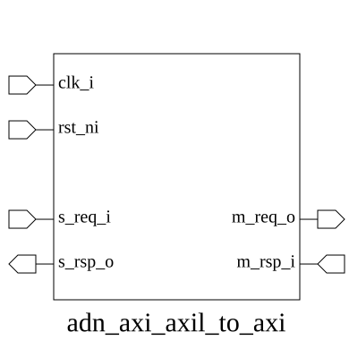
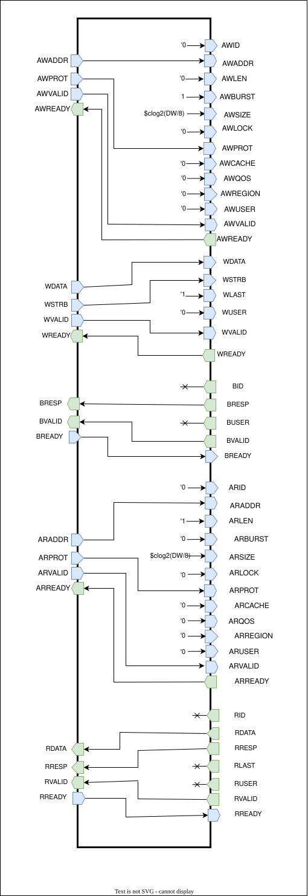

# adn_axi_axil_to_axi (module)

### Source: adn_axi_axil_to_axi.sv

## Top IO

## Parameters

|Name|Type|Dimension|Default|Description|
|-|-|-|-|-|
|ADDR_WIDTH|int||32||
|DATA_WIDTH|int||32||
|ID_WIDTH|int||4||
|USER_WIDTH|int||1||
|axil_req_t|type||logic||
|axil_rsp_t|type||logic||
|axi_req_t|type||logic||
|axi_rsp_t|type||logic||

## Ports

|Name|Direction|Type|Dimension|Description|
|-|-|-|-|-|
|clk_i|input|logic|||
|rst_ni|input|logic|||
|s_req_i|input|axil_req_t||AXI4-Lite Slave Interface|
|s_rsp_o|output|axil_rsp_t|||
|m_req_o|output|axi_req_t||AXI4 Master Interface|
|m_rsp_i|input|axi_rsp_t|||

## Description

_No top-level description found._
