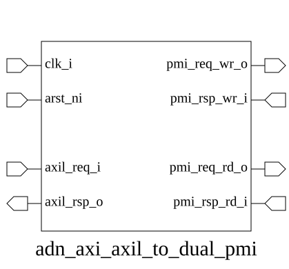
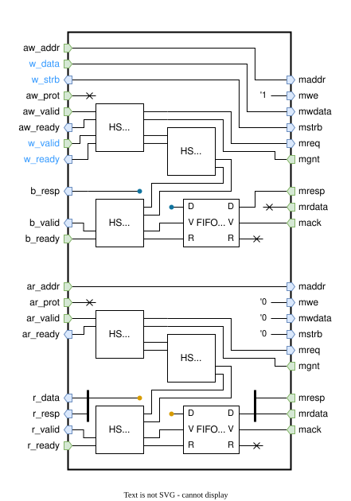

# adn_axi_axil_to_dual_pmi (module)

### Author: Adnan Sami Anirban (adnananirban259@gmail.com)

### Source: adn_axi_axil_to_dual_pmi.sv

## Top IO

## Parameters

|Name|Type|Dimension|Default|Description|
|-|-|-|-|-|
|axil_req_t|type||logic|AXI4-Lite request struct type|
|axil_rsp_t|type||logic|AXI4-Lite response struct type|
|pmi_req_t|type||logic|PMI request struct type|
|pmi_rsp_t|type||logic|PMI response struct type|
|PIPELINE_DEPTH|int||8|Max number of in-flight transactions|
|FIFO_SIZE|int||$clog2(PIPELINE_DEPTH)|FIFO depth based on pipeline|

## Ports

|Name|Direction|Type|Dimension|Description|
|-|-|-|-|-|
|clk_i|input|logic||System clock|
|arst_ni|input|logic||Active-low asynchronous reset|
|axil_req_i|input|axil_req_t||AXI4-Lite input request|
|axil_rsp_o|output|axil_rsp_t||AXI4-Lite output response|
|pmi_req_wr_o|output|pmi_req_t||PMI write request output|
|pmi_rsp_wr_i|input|pmi_rsp_t||PMI write response input|
|pmi_req_rd_o|output|pmi_req_t||PMI read request output|
|pmi_rsp_rd_i|input|pmi_rsp_t||PMI read response input|

## Description

# Purpose
This module acts as a bridge between the AXI4-Lite protocol and a dual-port PMI (Parallel Memory Interface) system. It translates AXI4-Lite read and write transactions into PMI-compliant requests, managing handshake synchronization, transaction pipelining, and response buffering to ensure data integrity and protocol compliance.

### Use Case
The `adn_axi_axil_to_dual_pmi` module is designed for SoC architectures where an AXI4-Lite master (such as a CPU or DMA controller) needs to interface with a high-performance memory subsystem or peripheral that utilizes the PMI protocol. By decoupling the AXI4-Lite handshake from the PMI request/acknowledge cycle, this module allows for pipelined memory access, effectively hiding memory latency and preventing bus stalls during high-throughput operations.

| REVISION | DATE       | AUTHOR          | DESCRIPTION                                            |
|----------|------------|-----------------|--------------------------------------------------------|
| 0.1      | 2026-08-13 | Adnan Sami Anirban | Initial version                                        |
| 1.0      | 2026-08-13 | Adnan Sami Anirban | Stable release                                         |

Author : Adnan Sami Anirban (adnananirban259@gmail.com)
