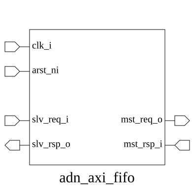

# adn_axi_fifo (module)

### Author: Md Sakhawat Hossain Sabbir (sabbirone939@gmail.com)

### Source: adn_axi_fifo.sv

## Top IO

## Parameters

|Name|Type|Dimension|Default|Description|
|-|-|-|-|-|
|axi_req_t|type||logic|AXI request structure type|
|axi_rsp_t|type||logic|AXI response structure type|
|FIFO_SIZE|int||4|Default FIFO depth for all channels|
|AW_FIFO_SIZE|int||FIFO_SIZE|Write Address channel FIFO depth|
|W_FIFO_SIZE|int||FIFO_SIZE|Write Data channel FIFO depth|
|B_FIFO_SIZE|int||FIFO_SIZE|Write Response channel FIFO depth|
|AR_FIFO_SIZE|int||FIFO_SIZE|Read Address channel FIFO depth|
|R_FIFO_SIZE|int||FIFO_SIZE|Read Data channel FIFO depth|

## Ports

|Name|Direction|Type|Dimension|Description|
|-|-|-|-|-|
|clk_i|input|logic||System clock|
|arst_ni|input|logic||Asynchronous reset, active low|
|slv_req_i|input|axi_req_t||AXI request signals from Master|
|slv_rsp_o|output|axi_rsp_t||AXI response signals to Master|
|mst_req_o|output|axi_req_t||AXI request signals to Slave|
|mst_rsp_i|input|axi_rsp_t||AXI response signals from Slave|

## Description

### Purpose
The `adn_axi_fifo` module provides a configurable, multi-channel FIFO buffer for AXI4 interfaces. It decouples the AXI master and slave by inserting independent FIFO buffers into each of the five AXI channels (AW, W, B, AR, and R), allowing for improved timing closure and throughput management in high-speed interconnects.

### Use Case
This module is primarily used in high-performance SoC designs to bridge clock domains or to act as a pipeline stage between AXI masters and slaves. By inserting this FIFO, designers can:
- **Improve Timing Closure:** Break long combinatorial paths between master and slave interfaces.
- **Increase Throughput:** Buffer bursts to prevent stalls in the AXI interconnect when the slave is temporarily busy.
- **Decouple Interfaces:** Allow the master and slave to operate with different backpressure characteristics without stalling the entire bus.

| REVISION | DATE       | AUTHOR                     | DESCRIPTION                                            |
|----------|------------|----------------------------|--------------------------------------------------------|
| 0.1      | 2026-08-09 | Md Sakhawat Hossain Sabbir | Initial version                                        |
| 1.0      | 2026-08-09 | Md Sakhawat Hossain Sabbir | Stable release                                         |

Author : Md Sakhawat Hossain Sabbir (sabbirone939@gmail.com)
