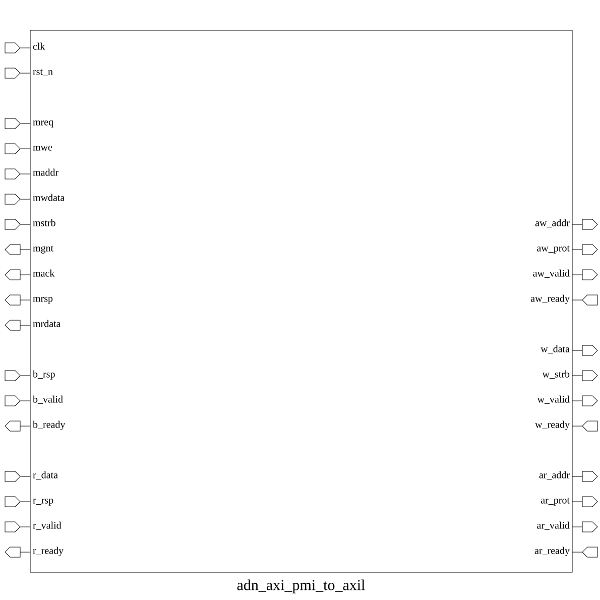
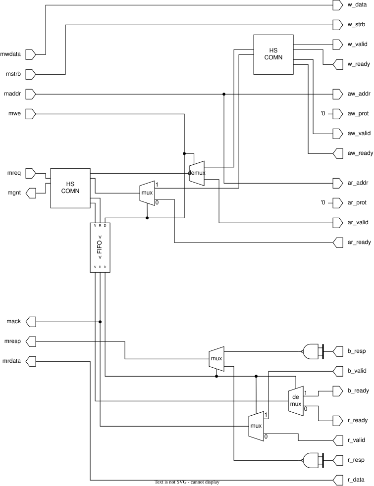

# adn_axi_pmi_to_axil (module)

### Author: Motasim Faiyaz (motasimfaiyaz@gmail.com)

### Source: adn_axi_pmi_to_axil.sv

## Top IO

## Parameters

|Name|Type|Dimension|Default|Description|
|-|-|-|-|-|
|pmi_req_t|type||logic|PARAMETERS|
|pmi_rsp_t|type||logic||
|axil_req_t|type||logic||
|axil_rsp_t|type||logic||
|FIFO_DEPTH|int||4|outstanding-txn tracking depth|

## Ports

|Name|Direction|Type|Dimension|Description|
|-|-|-|-|-|
|clk|input|logic|||
|rst_n|input|logic|||
|s_pmi_req|input|pmi_req_t||//////////////////////////////////////////////////////////////////////////////////////////////// PMI slave interface ////////////////////////////////////////////////////////////////////////////////////////////////|
|s_pmi_rsp|output|pmi_rsp_t|||
|m_axil_req|output|axil_req_t||//////////////////////////////////////////////////////////////////////////////////////////////// AXI4-Lite master interface ////////////////////////////////////////////////////////////////////////////////////////////////|
|m_axil_rsp|input|axil_rsp_t|||

## Description

@foez---bhai, write the purpose of this module in markdown format here. This is already in multi-line comment, so don't add any additional comment syntax.

@foez---bhai, describe the use case of this module in markdown format here. This is already in multi-line comment, so don't add any additional comment syntax.

| REVISION | DATE       | AUTHOR          | DESCRIPTION                                            |
|----------|------------|-----------------|--------------------------------------------------------|
| 0.1      | 2026-08-23 | Motasim Faiyaz | Initial version                                        |
| 1.0      | 2026-08-23 | Motasim Faiyaz | Stable release                                         |

Author : Motasim Faiyaz (motasimfaiyaz@gmail.com)
