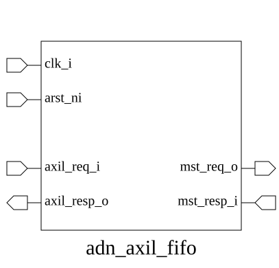

# adn_axil_fifo (module)

### Source: adn_axil_fifo.sv

## Top IO

## Parameters

|Name|Type|Dimension|Default|Description|
|-|-|-|-|-|
|axil_req_t|type||logic||
|axil_resp_t|type||logic||
|FIFO_SIZE|int||2||
|AW_FIFO_SIZE|int||FIFO_SIZE||
|W_FIFO_SIZE|int||FIFO_SIZE||
|B_FIFO_SIZE|int||FIFO_SIZE||
|AR_FIFO_SIZE|int||FIFO_SIZE||
|R_FIFO_SIZE|int||FIFO_SIZE||

## Ports

|Name|Direction|Type|Dimension|Description|
|-|-|-|-|-|
|clk_i|input|logic|||
|arst_ni|input|logic|||
|axil_req_i|input|axil_req_t||Slv side (from Master / CPU)|
|axil_resp_o|output|axil_resp_t|||
|mst_req_o|output|axil_req_t||Mst side (to Bridge / Register logic)|
|mst_resp_i|input|axil_resp_t|||

## Description

_No top-level description found._
