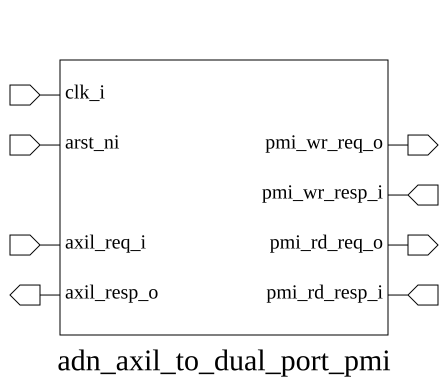

# adn_axil_to_dual_port_pmi (module)

### Source: adn_axil_to_dual_port_pmi.sv

## Top IO

## Parameters

|Name|Type|Dimension|Default|Description|
|-|-|-|-|-|
|axil_req_t|type||logic||
|axil_resp_t|type||logic||
|FIFO_SIZE|int||2||
|pmi_req_t|type||logic||
|pmi_resp_t|type||logic||

## Ports

|Name|Direction|Type|Dimension|Description|
|-|-|-|-|-|
|clk_i|input|logic|||
|arst_ni|input|logic|||
|axil_req_i|input|axil_req_t||AXI4-Lite slave side|
|axil_resp_o|output|axil_resp_t|||
|pmi_wr_req_o|output|pmi_req_t||PMI Write & Read Ports|
|pmi_wr_resp_i|input|pmi_resp_t|||
|pmi_rd_req_o|output|pmi_req_t|||
|pmi_rd_resp_i|input|pmi_resp_t|||

## Description

_No top-level description found._
