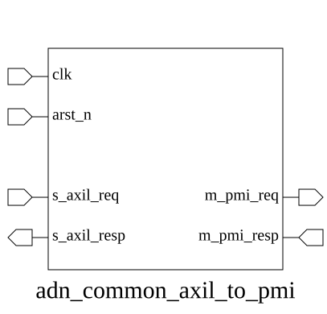
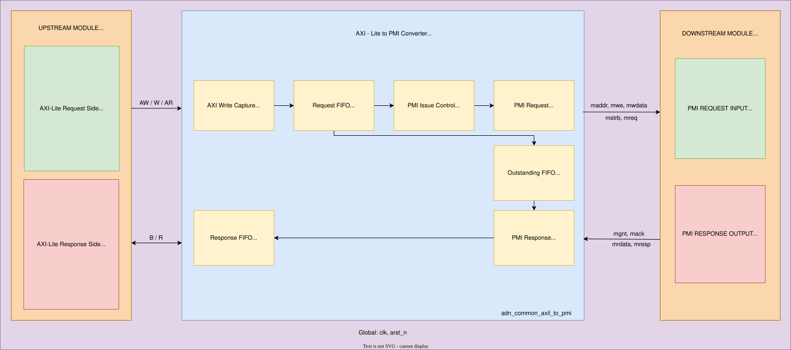

# adn_common_axil_to_pmi (module)

### Author: Md. Sakib Hasan Shawon (mdsakibhasanshawon20@gmail.com)

### Source: adn_common_axil_to_pmi.sv

## Top IO

## Parameters

|Name|Type|Dimension|Default|Description|
|-|-|-|-|-|
|ADDR_WIDTH|int||`ADDR_WIDTH||
|DATA_WIDTH|int||`DATA_WIDTH||
|FIFO_DEPTH|int||8|Depth of the internal transaction FIFOs|

## Ports

|Name|Direction|Type|Dimension|Description|
|-|-|-|-|-|
|clk|input|logic||Clock input|
|arst_n|input|logic||Active-low asynchronous reset|
|s_axil_req|input|axil_req_t||AXI-Lite slave request interface|
|s_axil_resp|output|axil_resp_t||AXI-Lite slave response interface|
|maddr|output|logic [ADDR_WIDTH-1:0]||PMI request address|
|mwe|output|logic||PMI write enable|
|mwdata|output|logic [DATA_WIDTH-1:0]||PMI write data|
|mstrb|output|logic [DATA_WIDTH/8-1:0]||PMI byte write strobe|
|mreq|output|logic||PMI request valid|
|mgnt|input|logic||PMI request grant|
|mack|input|logic||PMI transaction acknowledge|
|mrdata|input|logic [DATA_WIDTH-1:0]||PMI read response data|
|mresp|input|logic||PMI response error indicator|

## Description

### Purpose
The `adn_common_axil_to_pmi` module acts as a bridge interface that converts AXI-Lite transactions into a custom PMI (Private Memory Interface) protocol. It manages request buffering, transaction ordering, and response synchronization to ensure reliable data transfer between an AXI-Lite master and a PMI-compliant slave.

### Use Case
This module is designed for systems where an AXI-Lite master (such as a CPU or DMA controller) needs to communicate with a proprietary memory or peripheral subsystem that utilizes the Private Memory Interface (PMI). It handles the protocol translation, allowing the AXI-Lite master to perform standard read and write operations while the module manages the complexities of PMI handshaking, request queuing, and response reordering.

| REVISION | DATE       | AUTHOR          | DESCRIPTION                                            |
|----------|------------|-----------------|--------------------------------------------------------|
| 0.1      | 2026-08-09 | Md. Sakib Hasan Shawon | Initial version                                        |
| 1.0      | YYYY-MM-DD | Md. Sakib Hasan Shawon | Stable release                                         |

Author : Md. Sakib Hasan Shawon (mdsakibhasanshawon20@gmail.com)
